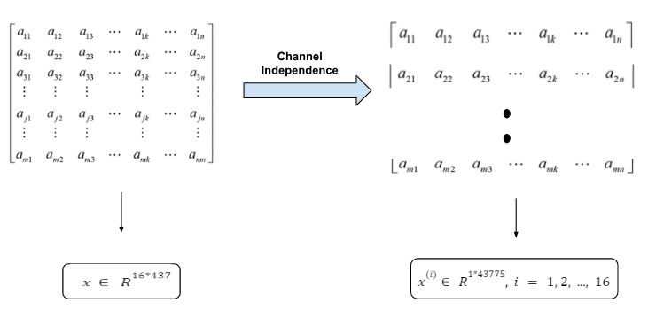
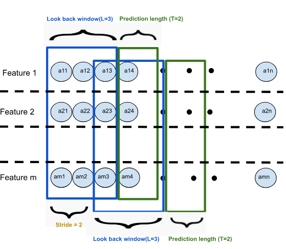
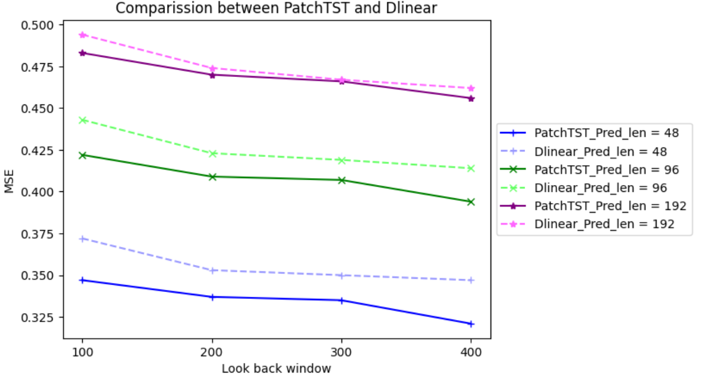

# multivariate-time-series-prediction
**Comparison between two state of the art methods in multivariate time series prediction for Panama electricity demand** 
In 2023, two different approaches for time series predictions have been introduced: 
-[Dlinea](https://arxiv.org/abs/2202.07125) 
-[PatchTST](https://arxiv.org/abs/2211.14730) 
In this article more detail about PatchTST has been provided and performance of these two approaches in [Panama Electricity Load Forecasting dataset](https://www.kaggle.com/datasets/pateljay731/panama-electricity-load-forecasting/data) will be compared. 
## Section 1: Introduction 
Traditional models like recurrent neural networks (RNNs) and long short-term memory (LSTM) networks often struggle with long-range dependencies and are computationally intensive due to their sequential processing nature. While transformers address these drawbacks by considering attention mechanisms. This mechanism allows models to focus on specific parts of the input data that are more relevant to the current task, rather than treating all parts of the input equally. Therefore, making it easier to model complex interactions that may get lost in traditional sequential models. Additionally, transformers process sequences in parallel, unlike RNNs and LSTMs, which process one step at a time. This speeds up training and makes the model more efficient. 
In recent years, some variations of transformers have been introduced to predict multivariate time series such as Informer (Zhou et al., 2021), Autoformer (Wu et al., 2021), and FEDformer (Zhou et al., 2022). In 2023, another study claimed the effectiveness of transformers and pointed to some drawbacks of it in time series forecasting. This drawback refers to the permutation-invariant feature of self attention which disregards the order of elements. Although various positional encoding techniques can help retain some order information, temporal information loss remains unavoidable when self-attention is applied on top of them. 
This limitation is generally not critical for tasks like natural language processing (NLP), where the overall meaning of a sentence remains largely intact even if the word order is altered. However, in time series analysis, where the data lacks inherent semantic meaning, the primary focus is on capturing the temporal dynamics between consecutive points. 
In this context, the order of the data is essential and plays a critical role in accurately modeling temporal patterns. In this study a simple linear model LTSF-Linear, Dlinear,  could get better results compared to other transformer methods.
After that another variant of the transformer called the PatchTST could solve the limitations of previous transformer approaches and beat the Dlinear model. 
## Section 2: PatchTST 
In below the main idea behind PatchTST approach have been provided: 
**1. Chanel independence** 
Data set converted from multivariate to univariate. In another word the data which has m*n dimensions converted to m vectors of 1*n dimensions. This process called channel independence means that input token only contains information from a single channel or feature. In the below picture an example of how it works provided. Aditionally, the dimension of real panama dataset mentioned in the below rectangulars. In our dataset we have 16 features which have been collected every hour from 03-01-2015 01:00 until 31-12-2019 23:00. Therefore, in general we have 43775 samples. 
 
**2. Patching** 
Previous works primarily focus on point-wise attention, which is applied to each element in isolation, without directly considering the relationships between groups of elements or substructures within the sequence. Since a single time step does not carry semantic meaning like a word in a sentence, extracting local semantic information is essential for analyzing the connections between time steps. This new approach emphasizes understanding the relationships between different time steps to effectively extract local semantic information. 
Another important issue to address is the reduction of time and space complexity. In prior works, transformers process entire input tokens, resulting in quadratic complexity. By applying patching, the token with size 𝑁 can be reduced to 𝐿/S, where S refers to the stride. In the diagram below, a look-back window of size 3 is applied, followed by another look-back window after 2 strides. Based on each look-back window, we can predict the next sequence length, which is 2. Patching divides the input into smaller parts, leading to significant savings in complexity. 
 
## Section 2: Experiment on dataset 
**1. Data preparation:** 
There are 15 independent features in this data set and 1 dependent feature. 
-Independent features: 
  -12 numerical continuous features which refer to Weather Parameters. 
  -3 categorical variables which are details of the Special days (Holidays, Holidays_ID, School days) 
There are **no null values** in the dataset, and the only preprocessing step applied was standardizing the data by removing the mean and scaling to unit variance. This was done using the `StandardScaler` from `sklearn`. 
**2.Split dataset to three parts:** 
-Train: 70%--->30642 samples 
-Validation: 10%----->4378 samples 
-Test: 20%---->8755 samples 
**3. Train the models:** 
In the `panama_elct.sh` more detail about training parameters such as batch size, number of epochs, learning rate, look back window, prediction length and so on has been provided. 
Some expariments for differnet values of look back window and prediction length have been done and the result provided in below figure. 
-look back window: [100, 200, 300, 400] 
-Prediction length: [48, 96, 192] 
 

star: Conclusion from the result: 

